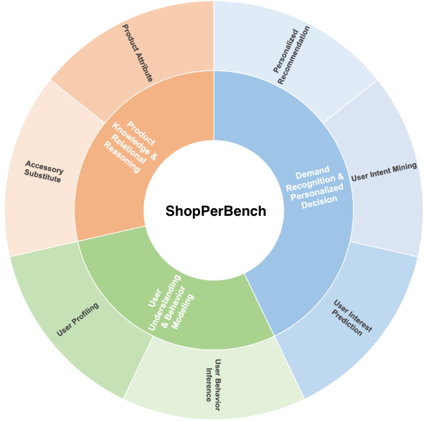
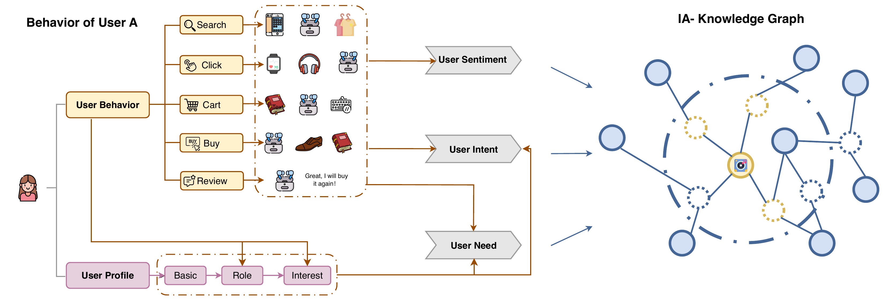
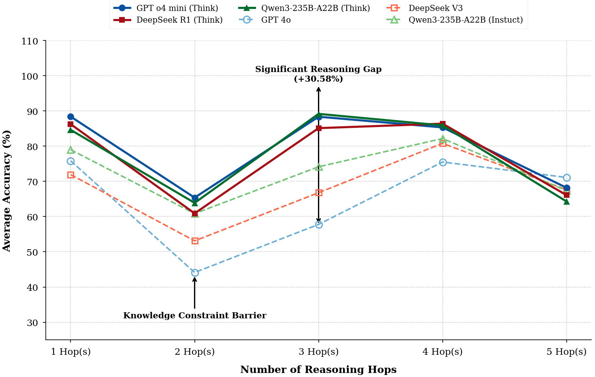

# 🛍️ ShopPerBench: Personalization Meets Explainable Reasoning in E-commerce

<div align="center">

[](https://kdd.org/)
[](https://www.acm.org/)
[](.)
[](.)
[](.)

**Lulu Zhao · Zhengyang Wang · Xingyao Zhang · Xuefeng Chen · Wenbo Su**

*Alibaba Group*

> 📢 **Dataset will be released soon!**

</div>

---

## 🔥 TL;DR

**ShopPerBench** is the **first** multi-task benchmark for **personalized e-commerce reasoning**, built from real-world, long-horizon (up to 12 months) user interaction logs on TaoBao. We also introduce **BiWalker-Shop**, a graph-driven data synthesis pipeline that generates traceable, controllable reasoning trajectories. Evaluation of **17 state-of-the-art LLMs** shows even the best model (Gemini-3-flash) achieves only **75.38%** average accuracy — proving this is a genuinely hard, unsolved problem.

---

## 📖 Abstract

Large language models (LLMs) are transforming e-commerce, yet evaluating their reasoning in complex, long-term, and personalized shopping scenarios remains a challenge. Existing benchmarks often rely on isolated behaviors or simulated environments, failing to capture the causal logic of real-world interactions.

We propose **ShopPerBench**, the first multi-task benchmark for personalized e-commerce reasoning based on authentic, long-horizon user logs. To construct it, we develop **BiWalker-Shop**, a graph-driven synthesis pipeline that integrates an *Item Attribute Knowledge Graph* with a *User Behavior Profile Decision Tree* to generate traceable reasoning trajectories across **seven tasks**.

Evaluation of over **17 SOTA LLMs** shows that even top-tier "Think" models achieve a peak average success rate of only **75.38%**. We also uncover a critical **"strategic shortcut"** phenomenon and characterize how reasoning failures evolve from independent factual errors to cascading logical collapses.

---

## 🆚 Why ShopPerBench? Benchmark Comparison

Unlike prior work, ShopPerBench is the **only** benchmark covering all critical dimensions for real-world personalized e-commerce reasoning:

| Dataset | Instances | Tasks | Real-world | Reasoning | Long-term | Product Knowledge | User Behavior | Personalized Info |
|---|---|---|---|---|---|---|---|---|
| Amazon-M2 | 361,659 | 3 | ✅ | ❌ | ❌ | ❌ | Partial | ❌ |
| Amazon-ESCI | 178,952 | 3 | ✅ | ❌ | ❌ | ✅ | ❌ | ❌ |
| EComInstruct-Test | 6,000 | 12 | ❌ | ❌ | ❌ | Partial | ❌ | ❌ |
| ECInstruct | 9,253 | 10 | ❌ | ❌ | ❌ | Partial | ❌ | ❌ |
| Shopping MMLU | 20,799 | 57 | ✅ | Partial | ❌ | Partial | Partial | ❌ |
| ChineseEcomQA | 1,800 | 10 | ✅ | Partial | ❌ | ✅ | Partial | ❌ |
| WebShop | 500 | 1 | ❌ | ❌ | ❌ | ✅ | ❌ | ❌ |
| DeepShop | 692 | 2 | ❌ | ❌ | ❌ | ❌ | ✅ | ✅ |
| ShoppingBench | 900 | 4 | ❌ | ❌ | ❌ | ✅ | ❌ | ❌ |
| **ShopPerBench (Ours)** | **7,965** | **7** | ✅ | ✅ | ✅ | ✅ | ✅ | ✅ |

> ShopPerBench is the only benchmark that simultaneously supports real-world data, reasoning evaluation, long-term preference modeling, product knowledge, user behavior, and personalized information.

---

## 🗺️ Task Taxonomy

ShopPerBench covers **7 specialized tasks** organized under **3 core reasoning capabilities**:

<div align="center">


*Hierarchical taxonomy of ShopPerBench tasks across three core reasoning capability dimensions.*
</div>

### Three Capability Dimensions

| Capability | Tasks |
|---|---|
| 🟠 **Product Knowledge & Relational Reasoning** | Product Attribute, Accessory Substitute |
| 🟢 **User Understanding & Behavior Modeling** | User Profiling, User Behavior Inference |
| 🔵 **Demand Recognition & Personalized Decision** | User Interest Prediction, User Intent Mining, Personalized Recommendation |

### Task Details

| Task | Instances | Avg. Tokens | Avg. Hops | Description |
|---|---|---|---|---|
| **Product Attribute** | 1,171 | 1,397.1 | 1.2 | Predict fine-grained product attributes from item descriptions |
| **Accessory Substitute** | 917 | 1,297.0 | 2.1 | Find compatible accessories or substitutes given product context |
| **User Profiling** | 821 | 3,138.6 | 2.4 | Aggregate long-term behaviors into a structured user profile |
| **User Interest Prediction** | 1,008 | 3,771.6 | 2.8 | Predict user interests from behavioral sequences |
| **User Intent Mining** | 1,478 | 1,197.1 | 3.5 | Infer implicit shopping intent from interaction patterns |
| **User Behavior Inference** | 1,396 | 1,490.8 | 4.2 | Infer causal behavioral logic across multi-session history |
| **Personalized Recommendation** | 1,174 | 1,223.1 | 4.7 | End-to-end recommendation fusing profile + product knowledge |
| **Total** | **7,965** | — | — | — |

> 📌 **Note**: User Profiling (3,138.6 tokens) and User Interest Prediction (3,771.6 tokens) have the highest average token counts, reflecting the complexity of aggregating months of behavioral data.

---

## ⚙️ BiWalker-Shop: Data Synthesis Pipeline

<div align="center">


*The BiWalker-Shop workflow. Solid circles = products; dashed circles = attributes.*
</div>

BiWalker-Shop is a **dual-domain coupled graph architecture** that generates fully traceable, controllable reasoning trajectories via four components:

### 1. 📦 IA-Knowledge Graph (Item Attribute)
Built from a **trillion-scale item library** from TaoBao's production engine:
- Stratified sampling across **20+ major product categories** over **12 months**
- **10,000+** unique item nodes and **50,000+** fine-grained attribute nodes
- LLM-augmented annotation to unify heterogeneous descriptors
- Formal definition: **G = (I, A, E)** — items, attributes, and typed logical relations

### 2. 👤 UBP-Decision Tree (User Behavior Profile)
A hierarchical representation of user knowledge with two core branches:
- **User Behavior Branch**: Captures Search / Click / Cart / Buy / Review actions across multi-scale temporal windows (`< 1 week`, `< 1 month`, `> 1 year`)
- **User Profile Branch**: LLM-extracted semantic features — Interests, User Roles (e.g., "parenting expert", "outdoor enthusiast"), Core Preferences
- **30,000+** anonymized users with **1M+** raw interaction events
- Formally: **T_u = (B_u, P_u)** per user

### 3. 🔗 Coupling & Walk Strategy
Three **Bridge Modules** (`m_intent`, `m_need`, `m_sent`) semantically connect the two graphs:
- Reasoning trajectories sampled via **constrained meta-paths** (1–5 hops)
- **Short paths (1–2 hops)**: product attribute prediction, interest mining
- **Long paths (4–5 hops)**: end-to-end personalized recommendation
- LLM transforms structured "reasoning path slices" into natural language QA pairs

### 4. 🔍 Quality Control
A four-stage quality assurance process:
- **Trajectory Authenticity**: All reasoning chains extracted directly from real interaction logs
- **Distractor Criteria**: Logically consistent, adjustable-difficulty, and uniqueness-guaranteed wrong options
- **Difficulty Calibration**: Controlled via path depth (1–5 hops) and parallel constraint density
- **Expert Arbitration**: Multi-person, multi-round human verification across 4 dimensions (plausibility, linguistic specification, logical uniqueness, option homogeneity)

---

## 📊 Main Results

Performance of **17 leading LLMs** on ShopPerBench (accuracy %):

| Model | Product Attribute | Accessory Substitute | User Profiling | User Interest Prediction | User Intent Mining | User Behavior Inference | Personalized Recommendation | **Avg.** |
|---|---|---|---|---|---|---|---|---|
| GPT-4o mini | 58.50 | 27.59 | 46.89 | 53.27 | 45.87 | 57.88 | 62.86 | 50.41 |
| GPT-4o | 75.83 | 35.33 | 46.77 | 50.29 | 57.78 | 75.50 | 71.12 | 58.95 |
| GPT-4.1 | 79.42 | 44.17 | 57.98 | 54.17 | 69.76 | 72.85 | 67.04 | 63.63 |
| DeepSeek V3 | 71.91 | 37.51 | 61.39 | 60.42 | 66.78 | 80.80 | 67.63 | 63.78 |
| Qwen3-30B-A3B-instruct | 73.45 | 37.84 | 59.93 | 74.21 | 72.33 | 80.44 | 64.74 | 66.13 |
| Qwen3-235B-A22B-instruct | 78.99 | 49.95 | 59.32 | 73.31 | 74.15 | 82.16 | 67.38 | 69.32 |
| o3 | **88.56** | 61.05 | 52.98 | 58.83 | 82.27 | 60.82 | 62.86 | 66.77 |
| o4 mini | 88.39 | 57.69 | **62.97** | 75.49 | 88.36 | 85.33 | 68.19 | 75.20 |
| GPT-5 | 87.25 | 60.51 | 60.89 | 70.91 | 89.76 | 85.22 | 67.34 | 74.55 |
| DeepSeek R1 | 86.25 | 60.41 | 59.93 | 62.40 | 85.12 | **86.39** | 66.10 | 72.37 |
| Qwen3-14B | 84.71 | 54.85 | 58.47 | 66.96 | 83.76 | 71.56 | **72.74** | 70.44 |
| Qwen3-32B | 83.16 | 50.27 | 59.32 | 64.09 | 85.12 | 76.43 | 72.49 | 70.13 |
| Qwen3-30B-A3B-think | 81.04 | 58.02 | 54.45 | 69.54 | 87.96 | 82.66 | 70.27 | 71.99 |
| Qwen3-235B-A22B-think | 84.63 | **63.69** | 61.02 | 66.96 | **89.17** | 85.89 | 64.31 | 73.62 |
| Gemini-2.5-flash-lite | 72.92 | 32.38 | 62.00 | 80.06 | 68.47 | 79.73 | 69.42 | 66.43 |
| **Gemini-3-flash** | 85.36 | 65.67 | 61.35 | **82.33** | 73.86 | 83.15 | 75.92 | **75.38** |
| Claude Sonnet 4 | 77.97 | 50.16 | 54.81 | 63.69 | 65.83 | 85.10 | 65.84 | 66.20 |

### Key Findings
- 🥇 **Top 3**: Gemini-3-flash (75.38%) > o4 mini (75.20%) > GPT-5 (74.55%)
- 😰 **Hardest task**: Accessory Substitute (avg. 50.19% across all models)
- 😅 **Easiest tasks**: Product Attribute (80.49%), User Behavior Inference (78.50%)
- 📉 **Largest performance gap**: User Intent Mining spans 43.89 points (45.87–89.76%)
- 📈 **Most saturated task**: Personalized Recommendation (narrowest range: 13.06 points)

<div align="center">


*Model performance across the 7 tasks, ordered by reasoning depth (hops). A clear difficulty gradient emerges from Product Attribute (1-hop) to Personalized Recommendation (5-hop).*
</div>

---

## 📐 Data Statistics

| Metric | Value |
|---|---|
| Total instances | **7,965** |
| Product categories | **20+** |
| Observation period | **12 months** |
| IA-KG item nodes | **10,000+** |
| IA-KG attribute nodes | **50,000+** |
| Anonymized users in UBP | **30,000+** |
| Raw interaction events | **1,000,000+** |
| Reasoning depth range | **1–5 hops** |

---

## 🏆 Key Contributions

1. **ShopPerBench** — The first multi-task complex e-commerce reasoning benchmark based on real-world, long-term scenarios (up to 12 months), modeling interactions between personalized user information and product knowledge.

2. **BiWalker-Shop** — A highly scalable and interpretable data synthesis framework using a dual-domain coupled graph to generate traceable, controllable reasoning trajectories.

3. **Multi-dimensional LLM Analysis** — Uncovering the "strategic shortcut" mechanism, characterizing how reasoning failures evolve from independent factual errors to cascading logical collapses, providing concrete directions for optimizing e-commerce reasoning.

---

## 🔍 Experimental Setup

### Evaluated Models

**"Think" models:**
- Closed-source: o3, o4 mini, Gemini-2.5-flash-lite, Gemini-3-flash, Claude 4 Sonnet, GPT-5
- Open-source: DeepSeek R1, Qwen3-14B (think), Qwen3-32B (think), Qwen3-235B-A22B-think, Qwen3-30B-A3B-think

**"No-Think" models:**
- Closed-source: GPT-5, GPT-4.1, GPT-4o, GPT-4o mini
- Open-source: DeepSeek V3, Qwen3-235B-A22B-instruct, Qwen3-30B-A3B-instruct

### Inference Hyperparameters

| Parameter | Value |
|---|---|
| Temperature | 0.7 |
| Top-k | 20 |
| Top-p | 0.8 |
| Max new tokens | 30,000 |
| Context limit | 45,000 |

---

## 🛡️ Ethics & Privacy

- All data originates from **anonymized production logs** with multi-stage de-identification
- PII is replaced with randomly generated hash identifiers
- Temporal information is re-indexed into relative windows
- **Bias-aware expert review** audits for demographic stereotypes in reasoning paths
- Balanced sampling across demographic dimensions to prevent skewed heuristics

---

## 📚 Citation

```bibtex
@inproceedings{zhao2025shopperbench,
  title     = {ShopPerBench: Personalization Meets Explainable Reasoning in E-commerce},
  author    = {Zhao, Lulu and Wang, Zhengyang and Zhang, Xingyao and Chen, Xuefeng and Su, Wenbo},
  booktitle = {Proceedings of the ACM SIGKDD International Conference on Knowledge Discovery and Data Mining},
  year      = {2025},
  publisher = {ACM}
}
```

---

## 📬 Contact

- **Lulu Zhao** — zll476809@taobao.com (Alibaba Group)

---

<div align="center">

*"We hope ShopPerBench serves as a cornerstone for developing LLMs that truly understand user intent and deliver explainable shopping decisions."*

</div>
